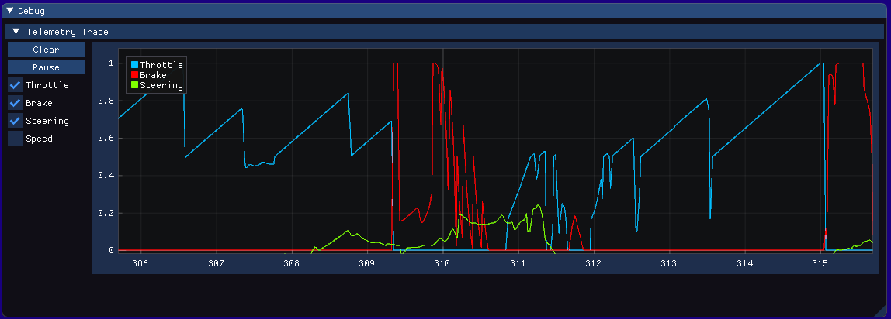

</table>

# 🅱️ono 
  
An F1 2019 UDP Connector, providing visualisation with ImPlot.  

* View and analyse your race session data in real time to eek out those last few tenths of lap time.
* Export race data to CSV for later analysis in a tool of your choice.
* Optimise your race strategy by seeing the condition of other drivers in real time.

  

## Planned Features

  * Save and graph all session data for race analysis
  * Configurable channel groups and data normalisation
  * Export session data to CSV for sharing/import 

## Usage

Ensure F1 2019 Telemetry is enabled, not in Broadcast mode, and the port is set to '20777'. This will be configurable in the future. 

Once a session begins, data will automatically be streamed to the program, enable the checkbox for the desired data sources.

🅱️ono works best with a 60Hz update rate.

## Keep up to date

#### Github Projects

Check out what I'm working on by looking at the Github Project boards for an upcoming point release [here](https://github.com/Bono/Bono/projects "Github Projects Page").

## Legal:
Released under the MIT License.

